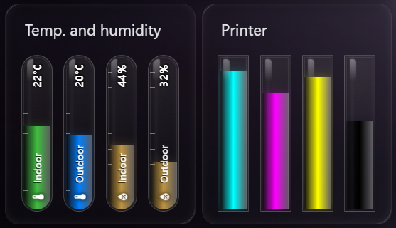

# 🌡️ Entity Glass Bar Card

A sleek, vertical glass-tube style bar card for Home Assistant. 

This card was originally created for personal use to achieve a specific, clean aesthetic on my own dashboard. I decided to share it with the Home Assistant community, hoping that others will find it useful and enjoy the design as much as I do.



---

## ✨ Features
*   **Glassmorphism Design:** Realistic glass effect with highlights, depth, and reflections.
*   **Smart Colors:** Automatic color logic for `temperature`, `humidity`, and `battery` device classes.
*   **Vertical Space Saving:** Uses rotated labels and icons to maximize information density.
*   **Precision Ticks:** Mathematically aligned measurement ticks.
*   **Interactive:** Built-in tap-action to open the "More Info" dialog for each entity.

---

## 🛠️ Installation

### Via HACS (Recommended)
1. Open **HACS** in your Home Assistant.
2. Go to **Frontend**.
3. Click the three dots in the top right and select **Custom repositories**.
4. Paste the URL of this repository and select **Lovelace** as the category.
5. Click **Add** and then **Download**.

---

## 📋 Configuration Options


| Option | Type | Default | Description |
| :--- | :--- | :--- | :--- |
| `title` | string | optional | The card title. |
| `height` | number | 200 | Total height of the bar in pixels. |
| `width` | number | 40 | Total width of the bar in pixels. |
| `radius` | number | 20 | Corner radius of the tube (capsule effect). |
| `color` | string | auto | Global bar color (RGB format, e.g., `255, 0, 0`). |
| `show_icon` | boolean | true | Show or hide the sensor icon. |
| `show_name` | boolean | true | Show or hide the entity name. |
| `show_value` | boolean | true | Show or hide the current state value. |
| `show_ticks` | boolean | true | Show or hide the measurement ticks. |

### Per-Entity Options
You can also define specific options for each entity:


| Option | Description |
| :--- | :--- |
| `name` | Override the friendly name. |
| `color` | Override the color for this specific entity (RGB). |
| `min` | Minimum value for the scale. |
| `max` | Maximum value for the scale. |

---

## 💡 Example Usage

```yaml
type: custom:entity-glass-bar-card
title: Home Status
height: 220
entities:
  - entity: sensor.living_room_temp
    name: Indoor
  - entity: sensor.outdoor_temp
    name: Outdoor
    color: "0, 128, 255"
  - entity: sensor.phone_battery
    name: Phone
```

---

## 🙏 Inspired By
This project was inspired by the following amazing works:
*   [bar-card](https://github.com) - For the foundation of bar-based visualizations.
*   [Frosted Glass Themes](https://github.com) - For the beautiful glass-morphism aesthetic.
